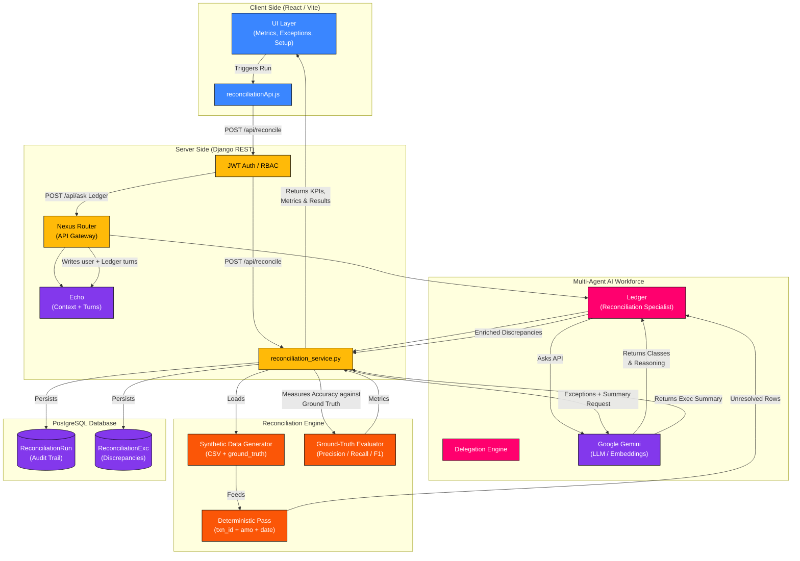

# Architecture Diagram

```mermaid
flowchart TD
    %% Define Styles
    classDef frontend fill:#3a86ff,stroke:#000,stroke-width:1px,color:#fff;
    classDef backend fill:#ffba08,stroke:#000,stroke-width:1px,color:#000;
    classDef agent fill:#ff006e,stroke:#000,stroke-width:1px,color:#fff;
    classDef memory fill:#8338ec,stroke:#000,stroke-width:1px,color:#fff;
    classDef data fill:#fb5607,stroke:#000,stroke-width:1px,color:#fff;
    
    subgraph Client ["Client Side (React / Vite)"]
        UI["UI Layer<br/>(Metrics, Exceptions, Setup)"]:::frontend
        API_Call["reconciliationApi.js"]:::frontend
    end
    
    subgraph Server ["Server Side (Django REST)"]
        Router["Nexus Router<br/>(API Gateway)"]:::backend
        RecService["reconciliation_service.py"]:::backend
        Auth["JWT Auth / RBAC"]:::backend
        Echo["Echo<br/>(Context + Turns)"]:::memory
    end
    
    subgraph Logic ["Reconciliation Engine"]
        SynData["Synthetic Data Generator<br/>(CSV + ground_truth)"]:::data
        DetMatch["Deterministic Pass<br/>(txn_id + amo + date)"]:::data
        Eval["Ground-Truth Evaluator<br/>(Precision / Recall / F1)"]:::data
    end
    
    subgraph AI_Workforce ["Multi-Agent AI Workforce"]
        DelEngine["Delegation Engine"]:::agent
        Ledger["Ledger<br/>(Reconciliation Specialist)"]:::agent
        Gemini["Google Gemini<br/>(LLM / Embeddings)"]:::memory
    end
    
    subgraph Persistence ["PostgreSQL Database"]
        RecRun[("ReconciliationRun<br/>(Audit Trail)")]:::memory
        RecExc[("ReconciliationExc<br/>(Discrepancies)")]:::memory
    end
    
    %% Flows
    UI -->|Triggers Run| API_Call
    API_Call -->|POST /api/reconcile| Auth
    Auth -->|POST /api/ask Ledger| Router
    Auth -->|POST /api/reconcile| RecService
    Router --> Echo
    Router --> Ledger
    Ledger --> RecService
    
    RecService -->|"Loads"| SynData
    SynData -->|"Feeds"| DetMatch
    DetMatch -->|"Unresolved Rows"| Ledger
    Ledger -->|"Asks API"| Gemini
    Gemini -->|"Returns Classes<br/>& Reasoning"| Ledger
    Ledger -->|"Enriched Discrepancies"| RecService
    
    RecService -->|"Exceptions + Summary Request"| Gemini
    Gemini -->|"Returns Exec Summary"| RecService
    
    RecService -->|"Measures Accuracy against<br/>Ground Truth"| Eval
    Eval -->|"Metrics"| RecService
    
    RecService -->|"Persists"| RecRun
    RecService -->|"Persists"| RecExc
    
    RecService -->|"Returns KPIs,<br/>Metrics & Results"| UI
    Router -->|"Writes user + Ledger turns"| Echo
```
