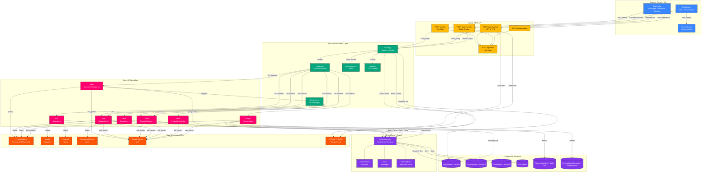

# Architecture Diagram

## Full System Architecture

```mermaid
flowchart TD
    %% Define Styles
    classDef frontend fill:#3a86ff,stroke:#000,stroke-width:1px,color:#fff;
    classDef backend fill:#ffba08,stroke:#000,stroke-width:1px,color:#000;
    classDef specialist fill:#ff006e,stroke:#000,stroke-width:1px,color:#fff;
    classDef orchestration fill:#06a77d,stroke:#000,stroke-width:1px,color:#fff;
    classDef memory fill:#8338ec,stroke:#000,stroke-width:1px,color:#fff;
    classDef data fill:#fb5607,stroke:#000,stroke-width:1px,color:#fff;
    
    subgraph Client ["Browser - React + Vite"]
        ChatUI["Chat Page<br/>Messages - Delegation Timeline"]:::frontend
        DashUI["Dashboard<br/>KPIs - Reconciliation"]:::frontend
        HistoryUI["History Drawer<br/>Conversations"]:::frontend
    end
    
    subgraph API ["Django REST API"]
        AuthView["POST /api/token<br/>JWT Auth"]:::backend
        AskView["POST /api/ask<br/>Text Chat"]:::backend
        VoiceView["POST /api/voice/ask<br/>STT to TTS"]:::backend
        ReconcileView["POST /api/reconcile<br/>Batch Engine"]:::backend
        SpecView["GET /api/specialists"]:::backend
    end
    
    subgraph Nexus ["Nexus Orchestration Layer"]
        Router["router.py<br/>Classify - Dispatch"]:::orchestration
        Registry["registry.py<br/>Specialist Lookup"]:::orchestration
        Permissions["permissions.py<br/>RBAC"]:::orchestration
        Delegation["delegation.py<br/>Handoff Engine"]:::orchestration
        Classify["classify.py<br/>LLM Routing"]:::orchestration
    end
    
    subgraph Workforce ["Seven AI Specialists"]
        Atlas["Atlas<br/>Executive Intelligence"]:::specialist
        Vega["Vega<br/>Data Analysis"]:::specialist
        Nova["Nova<br/>Financial Advisory"]:::specialist
        Aria["Aria<br/>Operations"]:::specialist
        Orion["Orion<br/>Compliance"]:::specialist
        Luna["Luna<br/>Product Knowledge"]:::specialist
        Ledger["Ledger<br/>Reconciliation"]:::specialist
    end
    
    subgraph Echo ["Echo Memory Engine"]
        ConvModel["Conversation<br/>Sessions"]:::memory
        TurnModel["Turn<br/>Messages"]:::memory
        FactModel["MemoryFact<br/>Key-Value Store"]:::memory
        EchoService["echo/service.py<br/>Context and Retrieval"]:::memory
    end
    
    subgraph DataSources ["Data Sources and APIs"]
        FinMetric["FinancialMetric<br/>Revenue, EBITDA, Cash"]:::data
        Vendor["Vendor<br/>Suppliers"]:::data
        Contract["Contract<br/>Terms"]:::data
        Compliance["ComplianceRecord<br/>Audit"]:::data
        Gemini["Google Gemini<br/>LLM"]:::data
        VoiceAPIs["STT and TTS APIs<br/>Google Cloud"]:::data
    end
    
    subgraph Persistence ["PostgreSQL Database"]
        OrgData[("Organization - Tenants")]:::memory
        MetricData[("FinancialMetric - Historical")]:::memory
        ConvData[("Conversation - Sessions")]:::memory
        TurnData[("Turn - History")]:::memory
        RecRun[("ReconciliationRun - Audit Trail")]:::memory
        RecExc[("ReconciliationException - Discrepancies")]:::memory
    end
    
    %% Frontend Flows
    ChatUI -->|Ask Question| AskView
    DashUI -->|Run Reconciliation| ReconcileView
    DashUI -->|View History| HistoryUI
    ChatUI -->|Record Audio| VoiceView
    ChatUI -->|Fetch Specialists| SpecView
    
    %% API Authentication
    AskView --> AuthView
    VoiceView --> AuthView
    ReconcileView --> AuthView
    SpecView --> AuthView
    
    %% Nexus Orchestration
    AskView -->|route_query| Router
    VoiceView -->|route_query| Router
    ReconcileView -->|invoke Ledger| Router
    
    Router -->|Classify| Classify
    Router -->|Check Access| Permissions
    Router -->|Load Context| EchoService
    Router -->|Lookup| Registry
    
    %% Specialist Dispatch
    Registry -->|Get Instance| Atlas
    Registry -->|Get Instance| Vega
    Registry -->|Get Instance| Nova
    Registry -->|Get Instance| Aria
    Registry -->|Get Instance| Orion
    Registry -->|Get Instance| Luna
    Registry -->|Get Instance| Ledger
    
    %% Delegation
    Atlas -->|Delegate| Delegation
    Delegation -->|Call| Vega
    Delegation -->|Call| Nova
    
    %% Echo Integration
    Router -->|Read Context| EchoService
    Atlas -->|Query Facts| EchoService
    Vega -->|Query Facts| EchoService
    Nova -->|Query Facts| EchoService
    Ledger -->|Query Facts| EchoService
    
    EchoService --> ConvModel
    EchoService --> TurnModel
    EchoService --> FactModel
    
    %% Data Access
    Atlas -->|Query| FinMetric
    Vega -->|Query| FinMetric
    Nova -->|Query| FinMetric
    Aria -->|Query| Vendor
    Aria -->|Query| Contract
    Orion -->|Query| Compliance
    Ledger -->|Reconciliation| FinMetric
    
    %% AI Calls
    Atlas -->|ask_gemini| Gemini
    Vega -->|ask_gemini| Gemini
    Nova -->|ask_gemini| Gemini
    Aria -->|ask_gemini| Gemini
    Orion -->|ask_gemini| Gemini
    Luna -->|ask_gemini| Gemini
    Ledger -->|ask_gemini| Gemini
    
    %% Voice
    VoiceView -->|Transcribe| VoiceAPIs
    VoiceView -->|Synthesize| VoiceAPIs
    
    %% Persistence
    EchoService -->|Write| ConvData
    EchoService -->|Write| TurnData
    Ledger -->|Persist| RecRun
    Ledger -->|Persist| RecExc
    
    %% Multi-tenancy
    Router -->|Scope by Org| OrgData
    EchoService -->|Scope by Org| OrgData
    Ledger -->|Scope by Org| OrgData
```
